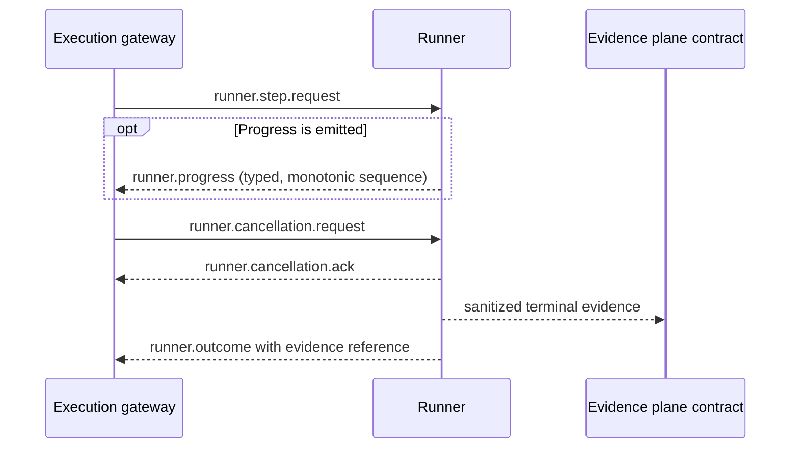

# Runner Protocol v2

Runner Protocol v2 is the canonical contract between an execution gateway and a runner. It normalizes dispatch, correlation, progress, cancellation, timeout, idempotency, errors and terminal evidence without granting authorization or changing any existing runner.

## Lifecycle and authority

- Owner: `EPIC-05` / delivery umbrella `SVP2-B-02`.
- Protocol version: `2.0.0`.
- Current implementation state: contract and vendor-neutral conformance kit available; no existing API, DevSecOps or AI/MCP runner is claimed conformant.
- Hermes remains the authorization authority. A valid protocol message cannot create, extend or replace authorization.
- Unknown versions, invalid messages, missing correlation or missing evidence fail closed.

## Message flow

The cancellation exchange is conditional. A normal completion may emit only the request, optional progress and terminal outcome.

## Correlation contract

Every message carries exactly four UUID correlation identifiers:

- `campaign_id`: authorized campaign context;
- `run_id`: one orchestration run inside the campaign;
- `step_id`: one logical step whose effect must be idempotent;
- `attempt_id`: one concrete attempt of that step.

Retries preserve `campaign_id`, `run_id`, `step_id` and `idempotency_key`, but use a new `attempt_id`. Logs, progress, errors, decisions and evidence derived from the message must retain all four identifiers.

## Idempotency

The request carries an `idempotency_key`. The canonical request fingerprint is a SHA-256 digest over these normalized fields:

- protocol major version;
- `campaign_id`, `run_id` and `step_id`;
- authorization reference;
- capability identifier and canonical JSON input;
- timeout, retry and cancellation policies.

`attempt_id` and `emitted_at` are deliberately excluded so a retry of the same logical effect has the same fingerprint.

Required runner behaviour when enforcement is implemented:

| Existing key | Candidate fingerprint | Result |
| --- | --- | --- |
| absent | any valid fingerprint | `NEW` |
| present | identical | `REPLAY_SAME` — return the recorded terminal result/evidence; do not repeat effects |
| present | different | `IDEMPOTENCY_CONFLICT` — refuse without execution |

A transient failure may be retried only when the runner can prove that no effect occurred or when the effect is intrinsically idempotent. An uncertain result after a possible effect becomes `INCONCLUSIVE`; it is not automatically retried.

## Progress

Progress is optional by default and may be requested as required for a specific capability. Absence of progress is not itself a failure; timeout budgets remain the temporal authority.

When progress is emitted:

- `sequence` starts at 1 and increases strictly for the same `attempt_id`;
- states are `accepted`, `running` or `cancelling`;
- percentages, when present, never decrease;
- messages are sanitized, bounded and contain no secret material;
- progress never substitutes a terminal outcome.

## Timeout and cancellation

Each request declares:

- `soft_timeout_ms`: initiates cooperative cancellation and records a `TIMEOUT_SOFT` event;
- `hard_timeout_ms`: maximum wall-clock budget; expiry yields `TIMED_OUT` and `TIMEOUT_HARD`;
- cancellation mode: cooperative or cooperative-then-force;
- `grace_period_ms`: bounded period between cancellation request and permitted force termination.

Semantic invariants:

1. `hard_timeout_ms` is greater than `soft_timeout_ms`.
2. `grace_period_ms` fits inside the hard timeout budget.
3. Cancellation is observable through an acknowledgement or a terminal timeout/error outcome.
4. Cancellation, timeout or loss of control can never produce `PASS`.
5. Force termination, when later implemented, remains sandbox/runtime enforcement and is not provided by this contract-only block.

## Retry policy

Automatic retry is limited to:

- `TRANSIENT_DEPENDENCY`;
- `RUNNER_UNAVAILABLE`;
- `TIMEOUT_SOFT`, only when no effect occurred.

Authorization, validation, compatibility, idempotency conflict, hard timeout, evidence and internal errors are not automatically retryable. Maximum attempts are bounded by the schema.

## Terminal outcomes and evidence

Terminal status is one of:

- `PASS`;
- `FAIL`;
- `ERROR`;
- `CANCELLED`;
- `TIMED_OUT`;
- `INCONCLUSIVE`;
- `REFUSED`.

Every terminal outcome carries at least one sanitized evidence reference. For pre-execution refusal, cancellation or timeout, the evidence may be a decision/protocol record rather than execution output. This preserves auditability while avoiding a false claim that technical execution occurred.

`PASS` is invalid without evidence and cannot carry an error. `ERROR`, `TIMED_OUT` and `REFUSED` require a normalized error.

## Normalized errors

Errors expose a stable code, category, retryability flag, bounded human-readable message and optional safe scalar context. Raw exceptions, stack traces, tokens, passwords, cookies, authorization headers, API keys, credentials and private keys are forbidden.

The initial stable codes are declared in the JSON Schema. Adding a code is a compatibility change; changing the meaning of an existing code is breaking and requires a protocol major version.

## Conformance kit

The vendor-neutral conformance kit is implemented in [`conformance.py`](conformance.py). It
starts a candidate adapter as a disposable process and exchanges language-neutral JSON-lines
control messages over standard input and output.

The candidate must support the test-only control actions `reset`, `dispatch`, `cancel`, `stats`
and `shutdown`. The kit exercises only synthetic `conformance.*` capabilities; it does not
invoke real security tools, customer targets or operational credentials.

The mandatory cases demonstrate:

- propagation of all four correlation identifiers and terminal evidence;
- replay of the same logical effect without increasing the candidate's effect counter;
- refusal of a changed effect under the same idempotency key;
- normalized hard timeout and transient dependency errors;
- cooperative cancellation with acknowledgement and terminal outcome;
- rejection of a controlled secret canary leak.

Results are written as a sanitized report conforming to
[`schemas/conformance-report.schema.json`](schemas/conformance-report.schema.json). The raw
candidate command is not persisted; only its SHA-256 digest is recorded.

A `PASS` verdict is necessary but not sufficient for promotion. It has no automatic promotion
effect, and human review remains mandatory. Third-party or untrusted candidates must run in an
isolated sandbox without customer network access, customer data, real credentials or production
secrets.

The adapter in [`fixtures/reference_adapter.py`](fixtures/reference_adapter.py) is test-only. It
proves the kit can accept a deterministic reference implementation and reject controlled broken
implementations. It is not an API, DevSecOps or AI/MCP runner and provides no production
conformance evidence.

## Compatibility

Compatibility rules and current adapter status are in [`compatibility.yaml`](compatibility.yaml).

- major versions must match exactly;
- an unknown major version fails closed before execution;
- optional fields may be added only when older consumers safely ignore them;
- removing or reinterpreting a required field requires a new major version;
- the three existing runner families remain `contract_only` until adapters and conformance evidence are integrated.

## Canonical artefacts

- [`schemas/runner-protocol-v2.schema.json`](schemas/runner-protocol-v2.schema.json)
- [`validate_protocol.py`](validate_protocol.py)
- [`compatibility.yaml`](compatibility.yaml)
- [`conformance.py`](conformance.py)
- [`schemas/conformance-report.schema.json`](schemas/conformance-report.schema.json)
- [`fixtures/reference_adapter.py`](fixtures/reference_adapter.py) — test-only
- [`tests/test_runner_protocol.py`](tests/test_runner_protocol.py)
- [`tests/test_conformance.py`](tests/test_conformance.py)

## Non-goals of this block

- no runner adapter or gateway enforcement;
- no change to existing pack/runbook semantics;
- no live cancellation, process termination or replay cache;
- no Evidence Plane implementation;
- no deployment, laboratory, Hermes or Kali MCP change.
