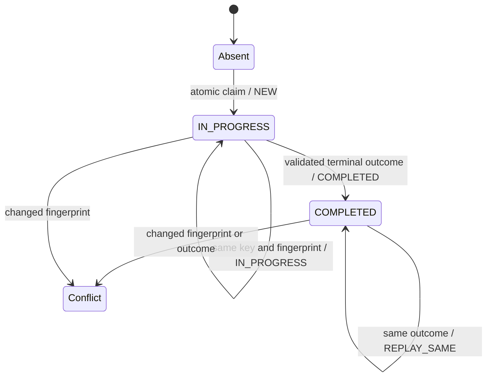

# Durable idempotency ledger

## Status

`IMPLEMENTING` — block 5 of `EPIC-05 — Runner Protocol v2`.

This document describes the repository-local durable ledger introduced in
`src/runner_protocol_v2/idempotency.py`. It does not promote or connect any runner adapter.
The API candidate remains synthetic-only, its execution integration remains `NOT_RUN`, and
promotion remains blocked.

## Objective

Prevent a repeated logical step from producing duplicate effects after process restart,
concurrent dispatch or retry. The ledger records one immutable relationship between:

- an `idempotency_key`;
- the canonical Runner Protocol request fingerprint;
- the execution state;
- one optional validated terminal `runner.outcome`.

The ledger is enforcement support. It does not authorize work, dispatch work or prove that a
real effect is safe.

## State model

An `IN_PROGRESS` record is deliberately not reclaimed automatically. After a crash or loss of
control, the caller must reconcile the possible effect and make a human or policy-backed decision.
Treating an abandoned claim as absent could repeat an effect whose completion is unknown.

## Atomicity and durability

The implementation uses the Python standard-library `sqlite3` module with:

- one database file supplied explicitly by the caller;
- `BEGIN IMMEDIATE` for claim and completion transitions;
- a primary key on `idempotency_key`;
- write-ahead logging (`WAL`);
- `synchronous = FULL`;
- a bounded busy timeout;
- schema versioning through `PRAGMA user_version`;
- `PRAGMA quick_check` during initialization;
- owner-only permissions (`0600`) for a newly created database.

The database must be stored in an existing, non-symlink directory outside the repository. An
in-memory database, symbolic-link path, malformed database, unknown schema version or
inconsistent record fails closed as `LedgerUnavailableError`.

## Claim classifications

| Existing state | Candidate fingerprint | Classification | Effect decision |
| --- | --- | --- | --- |
| no record | valid | `NEW` | caller may proceed after all other authorization and policy gates |
| `IN_PROGRESS` | identical | `IN_PROGRESS` | do not dispatch another effect |
| `COMPLETED` | identical | `REPLAY_SAME` | return the stored terminal outcome; do not repeat the effect |
| any record | different | `IDEMPOTENCY_CONFLICT` | refuse without execution |

A single atomic claim wins under concurrent access. Other claimers observe `IN_PROGRESS` or a
terminal replay state.

## Completion rules

A terminal outcome can be persisted only when:

1. the key was atomically claimed;
2. the fingerprint is identical to the claimed fingerprint;
3. the value is a schema-valid and semantically valid `runner.outcome`;
4. the record is still `IN_PROGRESS`.

A completed record is immutable. Repeating the exact same completion returns `REPLAY_SAME`.
A different outcome or fingerprint raises `LedgerConflictError`.

The implementation stores canonical JSON only. It relies on the Runner Protocol validator to
reject missing evidence, invalid error taxonomy and prohibited secret-bearing fields.

## Failure handling

- SQLite access, initialization or integrity failures become `LedgerUnavailableError`.
- Invalid caller input or invalid state transition becomes `LedgerStateError`.
- Changed immutable identity or outcome becomes `LedgerConflictError`.
- Unknown or corrupt persisted state is never interpreted as an empty ledger.
- Exceptions do not expose database content, outcomes, credentials or raw SQLite diagnostics.

## Validation

The test suite proves:

- atomic `NEW`, `IN_PROGRESS`, `REPLAY_SAME` and conflict classification;
- exactly one winner across concurrent claims;
- persistence and replay after closing and reopening the database;
- mandatory claim before completion;
- immutable fingerprint and terminal outcome;
- rejection of invalid outcomes, keys and fingerprints;
- fail-closed corrupt and future-version databases;
- rejection of in-memory and symbolic-link paths;
- owner-only database permissions.

## Explicit non-goals

This block does not:

- connect the ledger to the API synthetic candidate;
- connect the ledger to API, DevSecOps or AI/MCP production execution;
- reclaim abandoned `IN_PROGRESS` records automatically;
- implement distributed consensus or a multi-node database;
- authorize execution;
- store raw evidence, secrets or customer payloads outside the validated outcome;
- alter Hermes, Kali MCP, containers, laboratories, deployment or customer environments.

`NO_RUNTIME_CHANGE`
