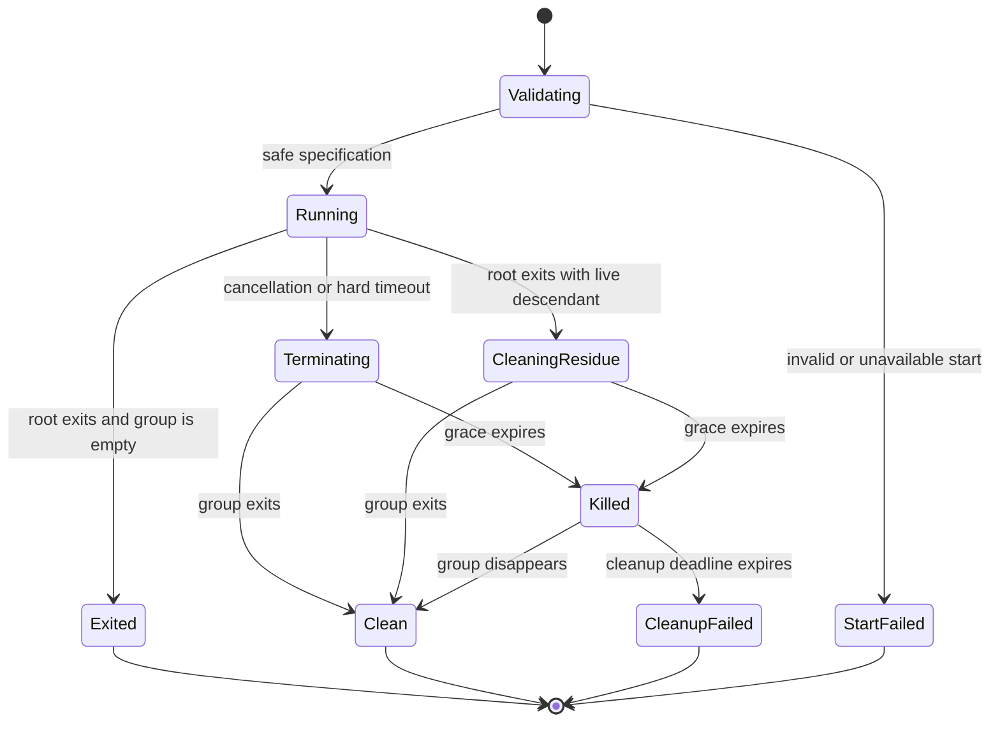

# Runner Protocol supervised process boundary

## Status

`IMPLEMENTING` — block 7 of `EPIC-05 — Runner Protocol v2`.

This block provides a reusable POSIX process-supervision primitive. It is not a runner
adapter, does not authorize work, does not select capabilities or targets, and is not yet
connected to the API, DevSecOps, AI/MCP, Hermes, Kali MCP or legacy execution paths.

## Purpose

A runner cannot claim bounded cancellation or hard timeout merely because its protocol
contains those fields. The process that performs an effect must be started inside an owned
lifecycle boundary, and the complete process tree must be terminated or explicitly reported
as cleanup failure before a terminal outcome is trusted.

The implementation is:

```text
platform/runner-protocol/src/runner_protocol_v2/supervision.py
```

## Safety invariants

Before process creation:

- the platform must provide POSIX process groups;
- the executable path must be absolute, resolvable, executable and a regular file;
- the working directory must be absolute and already exist;
- invocation uses an argument vector and never a shell;
- NUL bytes are rejected from arguments and environment values;
- caller-controlled environment keys are restricted to a small allowlist;
- hard timeout, termination grace, cleanup timeout, polling and output limits are bounded;
- a cancellation already requested returns `CANCELLED` without starting a process.

During execution:

- standard input is disconnected;
- standard output and error are captured independently with hard byte limits;
- the process starts in a new session and owns a new process group;
- file descriptors are closed except for the explicit standard streams;
- cancellation or hard timeout sends `SIGTERM` to the complete process group;
- expiry of the grace period escalates to `SIGKILL` for the complete group;
- root-process exit is not treated as success while another group member survives;
- surviving descendants are terminated and reported as `RESIDUE_CLEANED`;
- inability to verify cleanup becomes `CLEANUP_FAILED`, never success.

## Result model

The supervisor returns one of these local lifecycle states:

| Status | Meaning | Eligible for protocol `PASS` |
| --- | --- | --- |
| `EXITED` | Root exited and no process-group residue remains | only when return code and adapter policy allow it |
| `CANCELLED` | Cancellation was observed and cleanup completed | no |
| `TIMED_OUT` | Hard timeout expired and cleanup completed | no |
| `RESIDUE_CLEANED` | Root exited but a descendant survived and was removed | no |
| `CLEANUP_FAILED` | Complete cleanup could not be verified inside the bound | no |
| `START_FAILED` | Process creation failed before execution | no |

`EXITED` is deliberately not equivalent to `PASS`. The consuming adapter remains responsible
for authorization, capability mapping, exit-code policy, evidence creation, output parsing and
protocol outcome normalization.

## Lifecycle



## Test evidence required before merge

- clean process exits without forced cleanup;
- hard timeout kills a root process and a stubborn descendant in the same group;
- external cancellation escalates from `SIGTERM` to `SIGKILL` when required;
- a parent that exits while leaving a stubborn child is not classified as successful;
- the descendant PID no longer exists when the supervisor returns;
- standard output and error are independently truncated at the configured limit;
- relative executables and unsafe environment injection fail before process creation;
- source guard confirms `shell=True` and `preexec_fn` are absent;
- full repository, pack, Ruff and gitleaks gates remain green.

## Explicit limitations

This primitive is necessary but not sufficient for production execution.

- It is POSIX-only.
- A process group is not a container, namespace, cgroup, seccomp profile or network policy.
- It does not prevent a malicious child from creating a new session or escaping the group.
- It does not impose CPU, memory, file, process-count or network quotas.
- It does not drop privileges or select a service account.
- It does not provide distributed or multi-host cancellation.
- It does not reconcile uncertain external effects.
- Captured output remains untrusted data and must be parsed and redacted by the adapter.
- A later sandbox/runtime block must add stronger containment before real tools are connected.

## Promotion boundary

The supervisor may be reused by a synthetic adapter after this block is validated. Real API,
DevSecOps or AI/MCP capability execution remains blocked until adapter-specific authorization,
allowlisting, sandboxing, durable idempotency, evidence and Human-in-the-Loop controls are also
integrated and reviewed.

`NO_RUNTIME_CHANGE`
