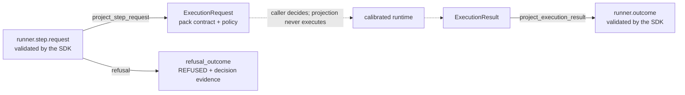

# AI/MCP runtime ↔ Runner Protocol v2 projection

## Status

`AS_BUILT` for a **contract projection only**. It is not production execution, not a
runner, not a promotion and not an authorization path. Compatibility state:
`CONTRACT_PROJECTION_ONLY`; `execution_integration` remains `NOT_RUN` and the AI/MCP
family remains `promotion_status: blocked`.

## Gap this closes

Before this module the repository had two disconnected halves:

| Half | What existed | What was missing |
| --- | --- | --- |
| Runner Protocol v2 | contract, SDK, conformance kit, durable ledger, POSIX supervisor, supervised synthetic candidates for three families | nothing addressed the calibrated AI/MCP runtime; the supervised candidate deliberately runs a fixed worker |
| Calibrated AI/MCP runtime | typed request/result contracts, policy allowlist, sanitiser, one calibrated handler (`agent/conversation-test`) | no canonical way to be addressed by a protocol message, and no way to express a runtime result as a validated terminal outcome |

The exact gap was therefore **contract translation**, not execution. A protocol message
could not name the runtime, and a runtime result could not be validated against the
protocol's terminal-outcome, evidence and error rules. That is what this module supplies,
and nothing more.

## What was implemented

[`security/packs/ai-mcp/src/ai_mcp_runbooks/runner_protocol_projection.py`](../src/ai_mcp_runbooks/runner_protocol_projection.py)
— a pure, side-effect-free boundary in two directions.

### Request direction

1. the protocol message is validated with `validate_semantics`;
2. only the capability `ai-mcp.runtime.handler-invoke` is accepted; any other capability is
   `UNSUPPORTED_CAPABILITY`;
3. `operation.input` is validated by `ExecutionRequest.from_payload`, the pack's single
   untrusted-input validation point;
4. `authorise_request` applies the pack allowlist and any narrowing execution policy.

Every failure raises a `ProjectionRefusal` carrying an already-normalized protocol error.
Raw pack exception text never reaches the protocol surface.

### Outcome direction

The runtime status maps to the terminal status:

| Runtime status | Terminal status | Note |
| --- | --- | --- |
| `ok` | `PASS` | |
| `dry-run` | `PASS` | |
| `skipped` | `INCONCLUSIVE` | |
| `not-implemented` | `REFUSED` | declared but uncalibrated handler |
| `error` | `ERROR` | normalized `EXECUTION_FAILED` |

A security **decision** is never a protocol failure: a handler that correctly proves a
target vulnerable is a successful step. `decision` travels in `output`, not in `status`.

Sanitisation is unconditional on the way out and the outcome carries only a digest of the
sanitised document, so prompt text, model output and synthetic markers cannot leave through
protocol evidence. Evidence identifiers are deterministic (UUID5 over the digest), so the
same logical result yields the same reference.

## Isolation guarantees, mechanically enforced

The projection imports the pack's `contracts`, `policy` and `sanitizer` modules and the
protocol SDK. It does **not** import `dispatch`, `execution`, any adapter, `subprocess`,
`socket`, `urllib`, `http` or `requests`, and it contains no reference to `execute_runbook`,
`execute_command`, `build_adapter` or `Popen`.

That is not a claim in prose: `_validate_projection_module` in the protocol SDK parses the
module's AST during `validate_compatibility_matrix()`, so a future edit that gives the
projection execution reach fails the contract gate in CI. Negative controls in
[`platform/runner-protocol/tests/test_runtime_projection_contract.py`](../../../../platform/runner-protocol/tests/test_runtime_projection_contract.py)
prove each gate actually fails when weakened.

## Authorization

`authorization_ref` is copied from the incoming protocol message and never created,
widened or interpreted as a grant. The pack policy can only refuse or narrow. Hermes
remains the authorization authority.

## Tests

| Suite | Covers |
| --- | --- |
| [`security/packs/ai-mcp/tests/test_runner_protocol_projection.py`](../tests/test_runner_protocol_projection.py) | both directions, every status, policy refusals, correlation propagation, sanitisation, determinism, static isolation invariants |
| [`platform/runner-protocol/tests/test_runtime_projection_contract.py`](../../../../platform/runner-protocol/tests/test_runtime_projection_contract.py) | the compatibility declaration, its agreement with the module on disk, and negative controls on both |

## CHG-HSL-093 controlled runtime composition

The pure projection above remains side-effect-free. A separate module,
`runtime_runner_protocol_adapter.py`, now composes it with the calibrated AI/MCP dispatch only
when a caller explicitly injects an executor. The adapter has no default executor, imports no
network/subprocess transport, claims a durable idempotency key before the controlled effect and
replays a completed outcome without a second effect. Repository acceptance exercises the real
calibrated `dispatch()` path with an in-memory transport only.

Lifecycle classification for CHG-HSL-093 is `PASS_CONTROLLED_IN_PROCESS`. At that merge, live network execution remained `NOT_RUN`; CHG-HSL-094 subsequently supersedes only that laboratory observation sub-state. Process supervision, cancellation/timeout integration, sandboxing, production execution and promotion are unchanged.

## CHG-HSL-094 controlled PromptMe live observation via RDC

On merged main `b4ada2ed220b788c775158a701ac220437d8716a`, the controlled adapter was exercised directly on HermesJarvas against the canonical PromptMe localhost publication proxy. The lifecycle smoke confirmed target egress denied; the calibrated runtime produced a sanitized `PASS` Runner outcome with runtime status `ok` and decision `vulnerable`; durable replay produced no second effect. The disposable ledger was removed, the lab was destroyed, and independent checks observed zero PromptMe containers and no listener on port 8210.

The initial combined `start` command suffered a transport timeout and therefore remains `UNKNOWN`; health was accepted only after a separate status observation showed target and proxy healthy. This evidence is classified `PASS_LAB_CONTROLLED_RDC` / `OBSERVED_LAB_CONTROLLED_RDC`. The request used test-only authorization semantics, not an operational Hermes authorization receipt. At CHG-HSL-094, process supervision was still `NOT_COMPOSED`; CHG-HSL-095 supersedes only that controlled-process sub-state. Sandbox `NOT_IMPLEMENTED`, production execution remains `NOT_RUN`, and promotion remains blocked.

## CHG-HSL-095 controlled process supervision

The calibrated PromptMe path is now composable through the repository-owned `PosixProcessSupervisor` using a fixed trusted worker. The Runner request cannot select an executable or argv. Durable idempotency is claimed before process creation; replay does not start a second process. Repository-controlled process tests demonstrate `PASS_CONTROLLED_PROCESS` supervision and hard-timeout cleanup, including SIGTERM-to-SIGKILL escalation and fail-closed handling when supervision is unavailable.

At CHG-HSL-095 the cancellation request remained **`NOT_RUN`**. CHG-HSL-097 now records cancellation request: **`PASS_LAB_CONTROLLED_RDC`** on exact functional commit `76ecc4aac3cb25e1697613a27304c6ca0dc082bd`: one real fixed PromptMe worker was cancelled after process creation, terminal `CANCELLED` was committed durably, replay created no second process, and a separate repository-owned hang fixture proved force-after-grace. Operational/deployed Control Plane cancellation remains **`NOT_RUN`**. Supervised live lab execution: **`PASS_LAB_CONTROLLED_RDC_SUPERVISED`**. A later canonical Phase-2 lifecycle start succeeded on HermesJarvas; the fixed supervised worker exited cleanly with Runner `PASS`, runtime `ok/vulnerable`, one first process, durable replay with no second process, target egress denied, Kali disconnected, and destroy/zero-residue PASS. The earlier `NOT_RUN_TOOL_BLOCK` evidence is retained as historical evidence rather than rewritten. No operational authorization receipt, sandbox, production execution or promotion is inferred.

## Explicit limitations — not delivered here

- **no production execution.** Controlled in-process, controlled lab-network, and controlled
  process evidence exist, but no production runner execution has been activated.
- **no sandbox.** `sandbox_status` stays `NOT_IMPLEMENTED`.
- **no Evidence Plane integration.** The evidence reference is a digest, not a stored
  production artefact; persistence is future work.
- **projection remains pure.** Idempotency and supervision are enforced by the controlled
  adapters around the projection, not by the projection module itself.
- **no Runner cancellation-message execution.** Hard-timeout process cleanup is proven;
  `runner.cancellation.request` remains `NOT_RUN`.
- **no promotion.** The AI/MCP family stays `conformance_only`, `NOT_RUN`, blocked.
- **one calibrated handler.** Only `agent/conversation-test` is calibrated; `is_calibrated`
  reports this and the projection never promotes an uncalibrated handler.

`NO_PRODUCTION_RUNTIME_ACTIVATION`. No secret, credential, package visibility or production
deployment is introduced by CHG-HSL-095 or CHG-HSL-097.
