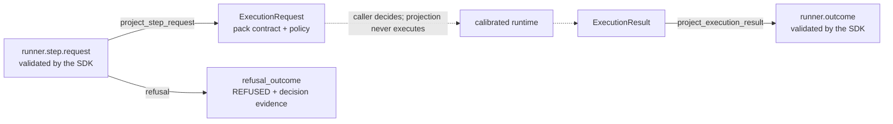

# AI/MCP runtime ↔ Runner Protocol v2 projection

## Status

`AS_BUILT` for a **contract projection only**. It is not production execution, not a
runner, not a promotion and not an authorization path. Compatibility state:
`CONTRACT_PROJECTION_ONLY`; `execution_integration` remains `NOT_RUN` and the AI/MCP
family remains `promotion_status: blocked`.

## Gap this closes

Before this module the repository had two disconnected halves:

| Half | What existed | What was missing |
| --- | --- | --- |
| Runner Protocol v2 | contract, SDK, conformance kit, durable ledger, POSIX supervisor, supervised synthetic candidates for three families | nothing addressed the calibrated AI/MCP runtime; the supervised candidate deliberately runs a fixed worker |
| Calibrated AI/MCP runtime | typed request/result contracts, policy allowlist, sanitiser, one calibrated handler (`agent/conversation-test`) | no canonical way to be addressed by a protocol message, and no way to express a runtime result as a validated terminal outcome |

The exact gap was therefore **contract translation**, not execution. A protocol message
could not name the runtime, and a runtime result could not be validated against the
protocol's terminal-outcome, evidence and error rules. That is what this module supplies,
and nothing more.

## What was implemented

[`security/packs/ai-mcp/src/ai_mcp_runbooks/runner_protocol_projection.py`](../src/ai_mcp_runbooks/runner_protocol_projection.py)
— a pure, side-effect-free boundary in two directions.

### Request direction

1. the protocol message is validated with `validate_semantics`;
2. only the capability `ai-mcp.runtime.handler-invoke` is accepted; any other capability is
   `UNSUPPORTED_CAPABILITY`;
3. `operation.input` is validated by `ExecutionRequest.from_payload`, the pack's single
   untrusted-input validation point;
4. `authorise_request` applies the pack allowlist and any narrowing execution policy.

Every failure raises a `ProjectionRefusal` carrying an already-normalized protocol error.
Raw pack exception text never reaches the protocol surface.

### Outcome direction

The runtime status maps to the terminal status:

| Runtime status | Terminal status | Note |
| --- | --- | --- |
| `ok` | `PASS` | |
| `dry-run` | `PASS` | |
| `skipped` | `INCONCLUSIVE` | |
| `not-implemented` | `REFUSED` | declared but uncalibrated handler |
| `error` | `ERROR` | normalized `EXECUTION_FAILED` |

A security **decision** is never a protocol failure: a handler that correctly proves a
target vulnerable is a successful step. `decision` travels in `output`, not in `status`.

Sanitisation is unconditional on the way out and the outcome carries only a digest of the
sanitised document, so prompt text, model output and synthetic markers cannot leave through
protocol evidence. Evidence identifiers are deterministic (UUID5 over the digest), so the
same logical result yields the same reference.

## Isolation guarantees, mechanically enforced

The projection imports the pack's `contracts`, `policy` and `sanitizer` modules and the
protocol SDK. It does **not** import `dispatch`, `execution`, any adapter, `subprocess`,
`socket`, `urllib`, `http` or `requests`, and it contains no reference to `execute_runbook`,
`execute_command`, `build_adapter` or `Popen`.

That is not a claim in prose: `_validate_projection_module` in the protocol SDK parses the
module's AST during `validate_compatibility_matrix()`, so a future edit that gives the
projection execution reach fails the contract gate in CI. Negative controls in
[`platform/runner-protocol/tests/test_runtime_projection_contract.py`](../../../../platform/runner-protocol/tests/test_runtime_projection_contract.py)
prove each gate actually fails when weakened.

## Authorization

`authorization_ref` is copied from the incoming protocol message and never created,
widened or interpreted as a grant. The pack policy can only refuse or narrow. Hermes
remains the authorization authority.

## Tests

| Suite | Covers |
| --- | --- |
| [`security/packs/ai-mcp/tests/test_runner_protocol_projection.py`](../tests/test_runner_protocol_projection.py) | both directions, every status, policy refusals, correlation propagation, sanitisation, determinism, static isolation invariants |
| [`platform/runner-protocol/tests/test_runtime_projection_contract.py`](../../../../platform/runner-protocol/tests/test_runtime_projection_contract.py) | the compatibility declaration, its agreement with the module on disk, and negative controls on both |

## Explicit limitations — not delivered here

- **no execution.** The projection never invokes the runtime. Wiring a gateway to call it
  and then execute is future work.
- **no sandbox.** `sandbox_status` stays `NOT_IMPLEMENTED`.
- **no Evidence Plane integration.** The evidence reference is a digest, not a stored
  artefact; persistence is future work.
- **no idempotency enforcement.** The projection classifies nothing; the durable ledger is
  not consumed on this path.
- **no progress or cancellation.** Only request and terminal outcome are projected.
- **no promotion.** The AI/MCP family stays `conformance_only`, `NOT_RUN`, blocked.
- **one calibrated handler.** Only `agent/conversation-test` is calibrated; `is_calibrated`
  reports this and the projection never promotes an uncalibrated handler.

`NO_RUNTIME_CHANGE`. No secret, credential, package visibility, Compose file, deployment or
external target is touched.
