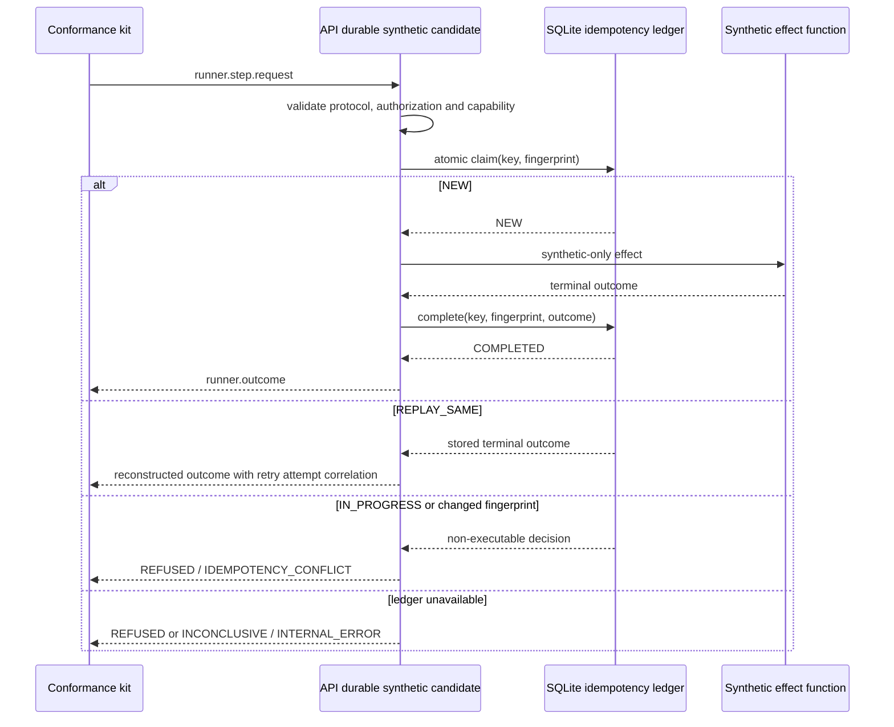

# API Runner Protocol durable synthetic candidate

## Status

`AS_BUILT` — block 6 of `EPIC-05 — Runner Protocol v2`, integrated through PR #115 at `3ff427e4c5122f0733bc04c9291acfdfc28b1448`.

The durable candidate is a synthetic-only integration between the API-family conformance
candidate and the repository-owned `SQLiteIdempotencyLedger`. It is not an API execution
adapter, does not authorize work and cannot invoke the existing runbook executor or Kali MCP.

## Activation boundary

The process is implemented at:

```text
security/packs/api/src/api_pentest_runbooks/durable_runner_protocol_adapter.py
```

It starts only when both arguments are present:

```text
--conformance-only --durable-ledger /absolute/path/outside/repository.sqlite3
```

The database parent must already exist. The path must be absolute and outside the current
working tree. Relative paths, repository paths, symbolic links, malformed databases and unknown
schema versions fail closed before the JSON-lines control loop starts.

The caller owns creation of the disposable directory, retention policy and secure deletion. CI
uses a temporary directory and removes the database and WAL artefacts after conformance.

## Execution flow



## Durable semantics

The candidate claims the key before entering the synthetic effect path.

- `NEW`: the synthetic effect may execute once.
- `REPLAY_SAME`: the stored terminal status, output or normalized error is replayed without a
  second synthetic effect. Correlation is reconstructed using the current retry `attempt_id`.
- `IDEMPOTENCY_CONFLICT`: the request is refused without a synthetic effect.
- `IN_PROGRESS`: treated as an idempotency conflict requiring reconciliation. It is not
  automatically reclaimed after restart.
- ledger unavailable before the effect: execution is refused with non-retryable
  `INTERNAL_ERROR`.
- ledger completion failure after the synthetic effect: the returned status is
  `INCONCLUSIVE`, non-retryable, and the durable claim remains unresolved.

The in-memory counter and cache remain test telemetry only. The SQLite ledger is the authority
for restart replay in durable mode.

## Cancellation

A `conformance.cancel.wait` dispatch creates an `IN_PROGRESS` durable claim and an in-memory
pending cancellation entry.

- cancellation in the same process produces acknowledgement plus `CANCELLED` and commits the
  terminal outcome to the ledger;
- replay after restart returns `CANCELLED` with the new attempt correlation and no effect;
- process loss before cancellation leaves `IN_PROGRESS`; a restarted candidate refuses replay
  and requires reconciliation.

This proves protocol semantics only. It is not live process supervision or force termination.

## Safety properties

- only `conformance.*` capabilities are accepted;
- only `authz/conformance/active` is accepted;
- real API capabilities are refused before a durable claim;
- customer authorization references are refused before a durable claim;
- there is no import or call to `execute_runbook`, `ProcessBridgeAdapter` or `execute_command`;
- there is no network or subprocess dependency;
- no raw evidence, credentials or customer payloads are stored;
- protocol outcomes are validated before persistence;
- promotion remains blocked and requires human review.

## Validation plan

- run the vendor-neutral conformance kit against a fresh disposable database;
- prove successful replay after constructing a new candidate over the same database;
- prove a changed effect is refused after restart;
- prove an `IN_PROGRESS` claim is not reclaimed after restart;
- prove same-process cancellation is committed and replayed after restart;
- prove real capability and authorization refusals do not create ledger records;
- prove CLI path and mode restrictions;
- prove completion failure returns non-retryable `INCONCLUSIVE`;
- retain AST guards against legacy execution and network/subprocess dependencies;
- run all API, protocol, pack, integration, Ruff and gitleaks gates.

## As-built evidence

- validated head: `dc08ff3779ef47fd48846efc6149b022617b107e`;
- squash merge: `3ff427e4c5122f0733bc04c9291acfdfc28b1448`;
- directed protocol/API/roadmap/docs suite: 929 passed;
- PR validate: `31090758807` — success;
- PR security/gitleaks: `31090759705` — success;
- post-merge validate: `31090875891` — success;
- post-merge security/gitleaks: `31090875979` — success;
- vendor-neutral conformance: `PASS_SYNTHETIC`;
- production execution integration: `NOT_RUN`;
- runtime validation: `NOT_APPLICABLE` — `NO_RUNTIME_CHANGE`.

## Explicit non-goals
## Explicit non-goals

- no production API capability mapping;
- no legacy executor or bridge integration;
- no DevSecOps or AI/MCP adapter integration;
- no distributed or multi-host ledger;
- no automatic recovery of uncertain effects;
- no live process cancellation or force termination;
- no customer target, laboratory, Hermes or Kali MCP execution;
- no production promotion claim.

`NO_RUNTIME_CHANGE`
