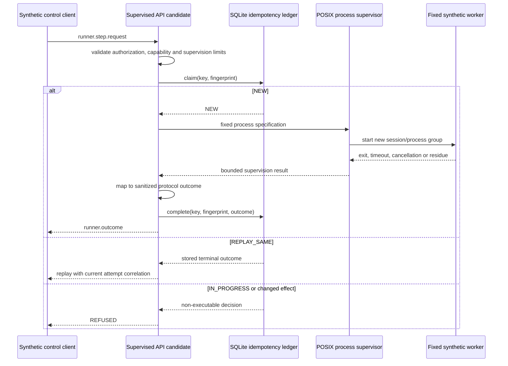

# API Runner Protocol supervised synthetic-process candidate

## Status

`IMPLEMENTING` — block 8 of `EPIC-05 — Runner Protocol v2`.

This candidate connects the durable idempotency ledger to the repository-owned POSIX
process supervisor using one fixed synthetic worker. It is not an API execution adapter,
does not authorize work, and cannot invoke the legacy runbook executor, Kali MCP, a
security tool, a network target or a command supplied by a request.

## Activation

The process is implemented at:

```text
security/packs/api/src/api_pentest_runbooks/supervised_runner_protocol_adapter.py
```

It starts only with all three controls:

```text
--conformance-only --synthetic-process-only --durable-ledger /absolute/path/outside/repository.sqlite3
```

The SQLite parent directory is also the disposable working directory for internal readiness
and descendant test files. Those names are derived from the idempotency key through SHA-256,
are never accepted from request input, and are removed before the candidate reports cleanup.

## Fixed execution boundary

The only executable chain is fixed in repository code:

```text
absolute Python interpreter
  -> synthetic_supervised_worker.py
  -> one allowlisted synthetic mode
```

Supported capabilities are:

- `conformance.process.success`;
- `conformance.process.execution-fail`;
- `conformance.process.timeout`;
- `conformance.process.cancel`;
- `conformance.process.residue`.

The `operation.input` object cannot select an executable, argument, working directory,
environment variable, target, URL, host, tool or worker mode. Real capabilities and customer
authorization references are refused before a durable claim or process creation.

## Dispatch and durable ordering



The durable claim is created before process start. A completed request replays after a new
candidate instance without starting another process. An uncertain `IN_PROGRESS` claim is not
reclaimed automatically.

## Asynchronous cancellation

`conformance.process.cancel` is the only asynchronous capability in this candidate.

1. The candidate claims the durable key.
2. A non-daemon supervisor thread is created.
3. The fixed worker writes an internal readiness file after installing its signal handler.
4. Only then does dispatch return `runner.progress`.
5. A matching cancellation request sets the supervisor event.
6. The process group receives `SIGTERM` and then `SIGKILL` after the bounded grace period.
7. Cleanup is verified, the `CANCELLED` outcome is committed, and the response contains
   acknowledgement followed by terminal outcome.

Shutdown sets cancellation on all active synthetic processes and acknowledges shutdown only
after every tracked supervisor has reached a terminal state. It refuses a clean shutdown
acknowledgement if cleanup cannot be confirmed inside the bound.

## Outcome mapping

| Supervision result | Protocol result | Error |
| --- | --- | --- |
| fixed success worker exits zero | `PASS` | none |
| fixed failure worker exits non-zero | `ERROR` | `EXECUTION_FAILED` |
| hard timeout with verified cleanup | `TIMED_OUT` | `TIMEOUT_HARD` |
| cancellation with verified cleanup | `CANCELLED` | `CANCELLED` |
| descendant residue removed | `INCONCLUSIVE` | `INTERNAL_ERROR` |
| cleanup cannot be verified | `INCONCLUSIVE` | `INTERNAL_ERROR` |
| process cannot start | `ERROR` | `RUNNER_UNAVAILABLE` |

A zero exit from a capability that expected another lifecycle state is `INCONCLUSIVE`, never
`PASS`. `RESIDUE_CLEANED` and `CLEANUP_FAILED` can never be promoted to success.

## Output handling

Raw standard output and error are not persisted or emitted in protocol output. The sanitized
outcome contains only:

- supervision status and return code;
- SHA-256 digest and captured byte count for each stream;
- truncation indicators;
- forced-kill, residue-cleaned and cleanup-failed indicators;
- bounded duration.

The resulting evidence reference is still synthetic protocol evidence. It is not customer
execution evidence and is not integrated with the future Evidence Plane.

## Validation evidence required before merge

- fixed success process yields `PASS` and durable replay starts no second process;
- request-provided `argv`, `cwd` and environment-shaped fields cannot change execution;
- non-zero worker exit maps to non-retryable `EXECUTION_FAILED` without raw stderr;
- hard timeout kills the stubborn process group and removes readiness state;
- asynchronous cancellation returns progress, acknowledgement and durable `CANCELLED`;
- cancellation replays after candidate restart without a second process;
- surviving descendants yield `INCONCLUSIVE`, are removed and leave no internal PID file;
- real capabilities and customer authorization references create no ledger record;
- invalid supervision limits fail before durable claim;
- shutdown cleans active synthetic processes before acknowledgement;
- CLI requires every synthetic-only activation flag;
- source guards prove no legacy executor, network client or direct subprocess invocation in the
  adapter;
- full repository, packs, integration, Ruff and gitleaks gates remain green.

## Explicit limitations

- no production API capability mapping;
- no DevSecOps or AI/MCP adapter integration;
- no container, namespace, cgroup, seccomp or network sandbox;
- no privilege drop, service account or resource quotas;
- no protection against a malicious process creating a new session;
- no distributed cancellation or multi-host ledger;
- no real authorization lookup, target allowlist or Rules of Engagement enforcement;
- no real evidence collection or chain of custody;
- no automatic reconciliation of abandoned `IN_PROGRESS` effects;
- no production promotion claim.

The compatibility status for this block is `PASS_SYNTHETIC_PROCESS`. Production execution
remains `NOT_RUN`, and promotion remains blocked.

`NO_RUNTIME_CHANGE`
